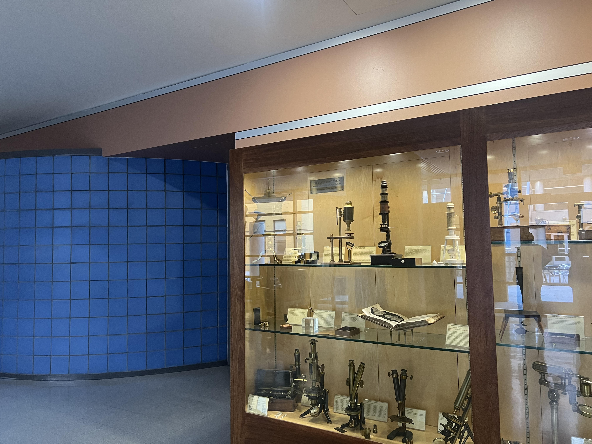

#  Project 4: Stitching Photo Mosaics

#  Overview

During this project, I created mosaics of various images by selecting correspondence points, and computing the corresponding homographies between the matrices.

#  Part 1. Taking Pictures

I started by taking several images of various environments, keeping the center of projection as close as possible, but rotating the camera just slightly to capture new information, with the eventual goal of stitching these images together to create a mosaic / panoramic. Here are the pairs of images I chose to create photo mosaics, all of which are places I find myself quite often.

| BAIR Image 1 | BAIR Image 2 | 
|:-------------------------:|:-------------------------:|
| |   |

| Grove Image 1 | Grove Image 2 | 
|:-------------------------:|:-------------------------:|
| |   |

| VLSB Hallway Image 1 | VLSB Hallway Image 2 | 
|:-------------------------:|:-------------------------:|
| |   |

#  Part 2. Recover Homographies

After shooting these pairs of images, I selected 8 correspondence points for each image.
I then wrote a function to compute the homography matrix, given a set of 4+ points for two images. 
Here's an example of correspondence points I picked for the nature images:

| VLSB Image 1 Correspondence Points | VLSB Image 2 Correspondence Points | 
|:-------------------------:|:-------------------------:|
| |   |

Due to having 4+ correspondences, we can set up an overdetermined systems of equations, where we can solve for H, which is a 3x3 matrix composed of 8 unknown values and a 1 as the 9th value, using least squares. 

H is a 3x3 matrix such that multiplying by the correspondence points of one image result in the correspondence points of the second image (scaled by a factor of w). 

In more explicit terms, the correspondence points of one image are a 3 x n matrix, where n represents the number of points and each row is respectively the x_coordinates, y_coordinates, and a row of 1s. 
It outputs a 3 x n matrix, where the first and second row are the x and y_coordinates of the points in the new image, scaled by a factor of w, found in the third row of the matrix.

# Part 3. Image Rectification

Once I recovered homographies, I tested homography on 'rectifying' objects within an image, essentially undoing the warping that taking a picture does to an object. I took two images containing rectangular objects that are warped within the image so that the direct shape is not rectangular, and then warping that object into a rectangular shape, therefore recovering the original shape of an object from an image.

In this first example, I selected 4 correspondence points surrounding this dentist billboard I pass by occassionally on Channing Street. I then estimated the shape of the rectified billboard. Using `skimage.draw.polygon`, I selected all the points within the rectified billboard space, and then inverse warped (by using the inverse of the homography matrix calculated on the 4 correspondence points and 4 new rectified corners) to find the corresponding un-rectified points. I then used `scipy.interpolate.
griddata` to interpolate the original colors onto the new rectified grid.

| Original Billboard Image | Rectified Billboard | 
|:-------------------------:|:-------------------------:|
| |   |

I performed the same rectification on this painting from an art gallery in Seattle I went to during the summer. 

| Original Artpiece Image | Rectified Artpiece | 
|:-------------------------:|:-------------------------:|
| |   |

As seen above for these two examples, homography worked successfully in order to warp an image into a desired shape.

# Part 4. Warping the Images

After performing rectification and confirming successful homography, I extended this application to warp images into each other to create a mosaic. Similarly to the above logic, I warped one image to the other like such:
1. Retrieve the correspondence points I chose in Part 2 for each pair of images.
2. Compute the homography matrix between the correspondence points of the two images.
3. Multiply the homography matrix by the **corner points** in Image 1 to get the estimated dimension of the warped image.
4. Calculate the *translatation* needed to get these corner points to a positive domain and store this as the translated corners of warped image 1.
5. Use these translated corners to estimate dimension of mosaic (warped Image 1 + Image 2)
6. Use `skimage.draw.polygon` to select all the positive points from the new warped image 1 and use inverse warping on the **non-shifted** points to retrieve the original points.
7. Use interpolation to place corresponding colors from the original image into the positive warped positions.

Following these steps, I warped all the first images in the 3 pairs to the corresponding second images. Here were the results:

| Original BAIR Image 1 | Warped BAIR Image 1 |
|:-------------------------:|:-------------------------:|
| |   |

| Original Grove Image 1 | Warped Grove Image 1 | 
|:-------------------------:|:-------------------------:|
| |   |

| Original VLSB Image 1 | Warped VLSB Image 1 | 
|:-------------------------:|:-------------------------:|
| |   |

# Part 5. Mosaic Blending

With these warped images, it was time to blend the warped image 1 with the corresponding image 2 to create a mosaic!
For each warped image, I mapped the corresponding image 2 into the correct position onto an empty image in the dimensions of the two images combined. *To do this, I shifted Image 2 by the same x and y shift from Part 4 to get the warped Image 1 to the positive domain.*

I then used 2-band blending to blend the Warped Image 1 and Image 2 together.
I first computed the distance transform for both images (`scipy.ndimage.distance_transform_edt`), using the Euclidean distance as measurement. 

Here is an example of the distance transform of the warped VLSB image 1 and VLSB image 2:

| Warped Grove Image 1 Distance Transform | Grove Image 2 Distance Transform | 
|:-------------------------:|:-------------------------:|
| |   |

Using the distance transform, I blended the low frequency components of the two images by using the distance transform as the weights in a linear combination of warped Image 1 and Image 2. I then blended the high frequency components of the two images by taking the corresponding value of an image based on which distance transform had a higher value for that point. Lastly, I combined the blended low frequency components and the blended high frequency components to end up with a smoothly blended mosaic image. For these three examples, I actually had a pretty good result for just blending the lower frequency components (even though it did blur some details), so I tended to weigh it higher when combining the low frequency and high frequency components, since the high frequency components added some strong edges / artifacts.

Here is an example:

| Combined Grove Low Frequency | Combined Grove High Frequency | 
|:-------------------------:|:-------------------------:|
| |   |

### And here are the results of all 3 mosaics! 

| Original BAIR 1 Image | Warped BAIR 1 Image | BAIR Image 2 |
|:-------------------------:|:-------------------------:|:-------------------------:|
| | |   |

**BAIR Mosaic**

| Original Grove 1 Image | Warped Grove Image 1 | Grove Image 2 | 
|:-------------------------:|:-------------------------:|:-------------------------:|
| |   |  |

**Grove Mosaic**

| Original VLSB 1 Image | Warped VLSB Image 1 | VLSB Image 2  | 
|:-------------------------:|:-------------------------:|:-------------------------:|
| |   |  |

**VLSB Mosaic**

# Project 4b: Autosticthing Mosaics

# Overview

In this part of the project, I followed implementations from the paper Multi-Image Matching using Multi-Scale Oriented Patches (MOPS), specifically Section 2, 3, 4, and 5, which enable us to blend images to create panoramas without manually selecting correspondence points.

## Harris Interest Point Detector (Section 2)

Using the starter code harris.py provided in the spec, I calculated the harris points of the image by converting the image to grayscale and then running get_harris_corners on the image. I ended up increasing sigma to 10 to get around ~4,000 points (instead of ~300,000 with sigma 1), which made the next steps (feature descriptor extraction and feature matching) much easier and faster to run. 

Here's an example of the Harris points on this picture of BAIR:

| Original BAIR Image | BAIR Harris Points | 
|:-------------------------:|:-------------------------:|
| |   |

## Adaptive Non-Maximal Suppression (Section 3)

To then narrow down the number of points extracted by the Harris Corner detection, I followed along with Section 3 of the MOPS paper to perform "Adaptive Non-Maximal Suppression" (ANMS). To ensure both strong corners and good spatial distribution across the image, we follow these steps:

1. Each corner's strength is obtained from the Harris response matrix
2. Using pairwise distance calculations between corners, I created a distance matrix.
3. Compare corner strengths using the threshold c_robust (I used a default of 0.9 like the paper) to identify stronger corners.
4. I then filtered the distances based on these strength comparisons
5. For each corner, find its minimum distance to a stronger corner
6. Finally, corners are ranked by these minimum distances, and the top num_corners (I used a default of 200 points) are selected

This approach ensures we get strong corners that are well-distributed throughout the image, rather than clustering all selected corners in a few high-response regions.

Here is an example of the original ~4,000 Harris points and the 200 strongest corners after applying ANMS:

| BAIR Harris Points | BAIR ANMS Points | 
|:-------------------------:|:-------------------------:|
| |   |

## Feature Descriptor extraction (Section 4)

For each selected corner point, we can create a feature descriptor by:

1. Taking a 40x40 pixel patch around each corner
2. Resizing each patch to 8x8 using interpolation
3. Normalizing each color channel by subtracting its mean and dividing by its standard deviation
4. Flattening the normalized 8x8x3 patch into a 192-dimensional vector

This process is applied to all images in the mosaic, resulting in two feature matrices where each row represents one corner's descriptor.

Here are examples of some of the 8x8 patches of "feature descriptors" on :

  
  
 
## Feature Matching (Section 5)

We then match features between the two images using a nearest-neighbor approach with Lowe's ratio test:

1. Calculate distances between all feature pairs from both images using sum of squared differences (SSD)
2. For each feature in the first image, find its two closest matches in the second image
3. Apply Lowe's ratio test: compare the distances to the closest and second-closest matches
4. Keep only the matches where the ratio is below the lowe_threshold (which I put as 0.5), indicating a strong unique match
5. Create pairs of indices representing the matched features between the two images
6. Filter these pairs using the Lowe ratio criterion

This approach ensures we only keep high-confidence matches where a feature has a clear best match, reducing false correspondences between the images.

Here is an example of 

## 4-point RANSAC

Following Section 5 of the MOPS paper, we use RANSAC (Random Sample Consensus) to find a robust homography between images by:

1. Repeatedly sampling 4 random point pairs from our matches
2. Computing a test homography from each sample (using the same computeH function from part A of the project)
3. Transforming all source points using this homography
4. Calculating distances between transformed points and their target locations
5. Counting how many points align within a threshold distance (inliers) -- I used a threshold of 0.8
6. Keeping track of the sample that produces the most inliers

The final homography is computed using all inlier points from the best sample. We use RANSAC to eliminate incorrect matches and find a transformation that works well for the majority of correct correspondences.

Here is an example of the final correspondence points after running RANSAC on the BAIR image:

| BAIR Harris Points | BAIR ANMS Points | BAIR RANSAC Points | 
|:-------------------------:|:-------------------------:|:-------------------------:|
| |   |  |

## Warp & Blend Images

Using these automatic correspondence points, I warped and blended the pairs of images, using the same functions as the previous part, to create 3 mosaics!

The first 2 examples were one that I did manually as well. I put both the manually stitched and autostitched mosaics side-by-side for comparison! 

### Example 1: BAIR Mosaic

| BAIR 1 Image | BAIR 2 Image | 
|:-------------------------:|:-------------------------:|
| |   |

| Manually Stitched Mosaic | Autostitched Mosaic | 
|:-------------------------:|:-------------------------:|
| |   |

### Example 2: VLSB Mosaic

| VLSB 1 Image | VLSB 2 Image | 
|:-------------------------:|:-------------------------:|
| |   |

| Manually Stitched Mosaic | Autostitched Mosaic | 
|:-------------------------:|:-------------------------:|
| |   |

### Example 3: Room Mosaic

| BAIR Harris Points | BAIR ANMS Points | BAIR RANSAC Points | 
|:-------------------------:|:-------------------------:|:-------------------------:|
| |   |  |

